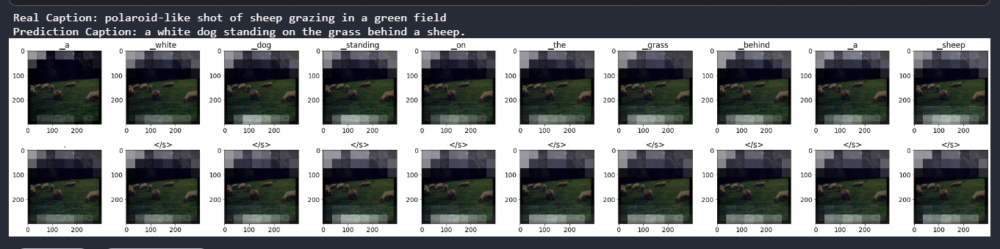
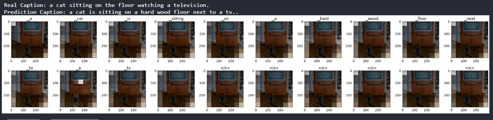
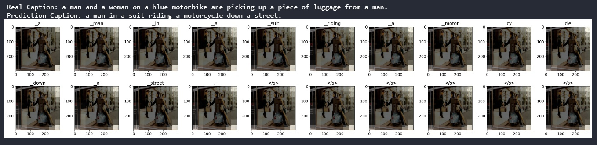
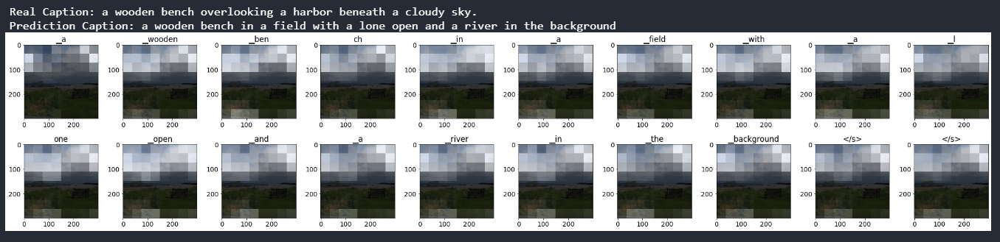
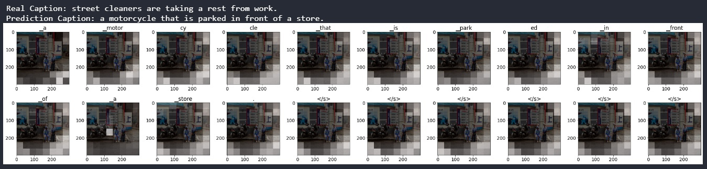
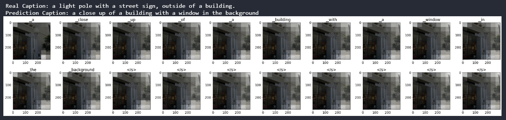

# ViT-for-Image-Captioning
Implementation of Vision Transformer to solve image captioning task, a simple way to achieve SOTA, in Pytorch

* Image captioning model based on Image2Seq Architecture (CNN Feature Extractor + LSTM with MultiHead Attention)

Basic model to understand task. I created model, you can use/develop it for free :)

Several examples of captioning:

---

---

---

---
Model has motorcycle bias so  it describes only vehicles if sees them on the picture.

---

---

* ViT for Masked-Image Modeling in Image2Seq

* ViT for Masked-Image Modeling in Full Transformer Architecture.

Trained on [COCO 2017 Dataset](https://cocodataset.org/#home)

Size of dataset is about 117k. 

I created unique pairs: Image - Caption (on average 5 Captions per Image). 

So I have 591753 objects in train dataset and 25014 objects in validation dataset but I used first 25k objects to train models and 5k to validate them (I don't have the ability to use more data).

Model | CNN + LSTM with Attn | ViT + LSTM with Attn | ViT + GPT |
--- | --- | --- | --- |
Train BLEU-1 | 0.641 | 0 | 0 |
Train BLEU-2 | 0.561 | 0 | 0 |
Train BLEU-3 | 0.487 | 0 | 0 |
Train BLEU-4 | 0.429 | 0 | 0 |
Valid BLEU-1 | 0.484 | 0 | 0 |
Valid BLEU-2 | 0.286 | 0 | 0 |
Valid BLEU-3 | 0.207 | 0 | 0 |
Valid BLEU-4 | 0.123 | 0 | 0 |

[Inspired](https://github.com/lucidrains/vit-pytorch) me for this project!
